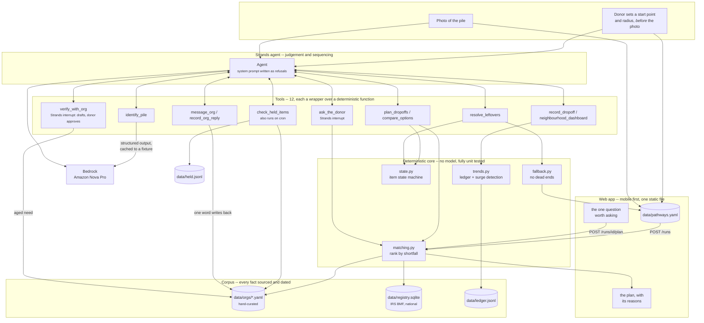

<h1 align="center">GiveRight</h1>

<p align="center">
  Matching what a neighborhood has to give away with what local organizations
  actually need this week.
</p>

---

Photograph a pile of things you no longer want. GiveRight identifies each item,
checks every nearby organization's real acceptance rules and current shortfall,
and returns one drop-off plan split across the right orgs.

When nothing will take an item, it keeps working.

## What makes it different

**The radius is a promise you can see.** Before the photo, the donor drops a
pin -- their location, or a parent's house, or wherever the pile actually is --
and drags a radius out to 50 miles. Every organization in the corpus is on the
map, and they light up as they come into range, so the count under the slider
is a real answer to "who could take this?" rather than a number to guess at.
Nothing outside that circle is ever offered, however badly it needs the item.

**It scores one thing, because it can only measure one thing.** The order is
nearest-first among organizations that listed the need. That is the entire
ranking, and it is the entire claim.

Three richer signals were built and then removed, each for the same reason.
*Stock levels*: almost no organization publishes them. *Org-stated urgency*:
nobody writes down a 0.7. *The age of a claim*: we know it exactly, but knowing
a fact is fifteen days old tells you nothing about how much less true it has
become, so discounting it by 45% was inventing a number to dress up a real one.
A ranking that only claims what it can measure is one a donor can check.

**Aged information gets checked, not discounted.** This is where the agent
earns its place. Instead of quietly sinking a stale need down the list, it says
how old the information is and offers to resolve it:

> Riverside Community Pantry: children's clothing last confirmed 26 days ago.
> Shall I email them your items and ask if they still need them?

Then it drafts the message carrying the donor's *actual* items, shows it for
approval, and takes any additions before it is sent.
Nobody answers "please confirm your inventory"; people answer "someone has six
toddler jumpers for you, do you still want them?". The corpus gets corrected as
a side effect of a real offer.

Shortfall survives as a capacity cap — it limits how much is sent and is shown
only when an organization actually told us. When they never said, the plan says
nothing rather than inventing a number.

**No Dead Ends, and the holding is real.** Every item reaches a terminal
answer. If no org will take it, the agent holds it and keeps watching for a new
local need, then tries a named reuse organization, then recycling, and only
then explains safe disposal.

"Keeps watching" is a background job, not a sentence. `watch.py` re-checks every
held item against a corpus that has moved since, on whatever cadence you run it:

```
*/30 * * * *  cd /srv/giveright && .venv/bin/python -m giveright.watch
```

It surfaces exactly two things -- an item that now has a home, and a hold that
has run out -- and in the ordinary case it finds neither and says nothing at
all. An agent that reports "I checked and there was nothing" every morning is a
notification people turn off, and then the one that mattered is off too. Each
hold carries the radius it was promised under, so a later sweep cannot quietly
offer the donor somewhere they never agreed to travel.

**Disposal is not recovery.** The headline metric counts reuse by a named
organization. Recycling and disposal are reported separately and never folded
in -- a metric that counts "here is how to bin it" as a save is not a metric.
See `recovery_rate` in [`state.py`](src/giveright/state.py).

**It works anywhere in the US, and is honest about what that means.** Two
layers, kept strictly apart because they are different kinds of claim.

*Who and where* is bulk-imported from the IRS Exempt Organizations Business
Master File — every live 501(c)(3) whose NTEE classification implies it handles
donated goods, geocoded through the Census Bureau. That is a dated public
record, so it satisfies the same provenance rule as everything else here.

*What they need* is not in there and is never guessed. A registry organization
carries **no needs at all**. It appears as somewhere that would accept the
item, ranked below anywhere that has actually asked, with its reason saying so
in as many words. Opening hours are left blank rather than invented.

```bash
python scripts/import_orgs.py --states DC MD VA    # the shipped corpus
python scripts/import_orgs.py --states all         # the whole country
```

The shipped registry covers the DMV -- 5,532 organizations across DC, Maryland
and Virginia -- and is committed, so a fresh clone has a working map without
running anything. It is generated data in version control, which is a trade
made deliberately: 2 MB against the alternative of someone opening this repo
and finding an empty map. Rebuild or extend it whenever; the file is replaced,
never merged. The importer is not region-specific; that is a decision about
what ships, not about what it can do. Coverage thins realistically outside
cities, which is why the radius runs to 50 miles: rural Shenandoah has nothing
inside 5 miles, 14 inside 15, and 151 inside 50.

That gap is the product, not a defect in it. `verify_with_org` emails a real
donation offer, the reply seeds the first need, and coverage deepens exactly
where donations actually happen.

**The corpus keeps itself honest, and orgs never touch software.** There is no
org portal, no login, no profile to maintain. An organization gets an email
about a real donation and answers with one word -- *TAKE THESE / FULL / DON'T
TAKE* -- and that answer writes straight back into the needs data. The corpus stays accurate as a side effect of orgs
doing the thing they already want to do: receive donations.

The one thing GiveRight does build for organizations is the dashboard, and it
is the same dashboard donors see.

**Facts never come from the model.** Hours, phone numbers and acceptance rules
are read from the corpus. The model identifies what is in the photo and explains
why an org was chosen. It is never the source of a fact a person will act on.

## How it works



Two lines matter in that picture.

The model reaches the world **only through tools**, and the tools reach the
world **only through the corpus**. A hallucinated opening time sends a person
across a city to a locked door, so opening times never pass through the model.

The arrow back from `record_org_reply` to `data/orgs/` is the maintenance
story. Nobody is asked to keep a profile up to date; an organisation taps one
of three buttons on a donation offer and that reply *is* the update.

## Interrupts, not notifications

The agent stops and hands control back exactly twice, both through the Strands
interrupt mechanism:

* **Condition** -- and only for items where the two plausible answers produce
  different plans. In the demo pile, four of five items are routed without
  asking anything; the towels are asked about because the answer moves them
  between two organisations. An agent that asks about every item is a form.
* **Writing to an organization** -- the agent drafts the email, then stops and
  shows it to the donor, who can approve it or add to it. Writing to a food
  bank on someone's behalf is not a decision an agent should make alone.

## Email only, on purpose

The agent has one outbound channel. It could place calls -- an earlier version
did, gated on a consent flag in the corpus -- and that was the wrong trade. An
organization that starts receiving voice calls it never asked for stops
answering its phone, and for a project whose entire asset is the goodwill of
local organizations, that is the failure worth avoiding. It also let a product
decision hide behind a legal-sounding one.

Phone numbers stay in the plan, because the donor is a neighbour and may ring
whoever they like. The agent does not.

## Status

Working end to end and under test (142 tests, no network, no credentials): the
domain model and item state machine, the organization corpus and its
append-only observation log, distance ranking, the clarification rule, the
no-dead-ends chain, the neighbourhood ledger, the twelve-tool Strands agent, an
HTTP API and a mobile web app, plus a deterministic terminal demo.

Models run on Amazon Bedrock, defaulting to Amazon Nova Pro, and both model
roles are set from the environment so comparing models is a shell variable
rather than a diff.

`data/orgs/dev_*.yaml` are clearly-marked synthetic fixtures. Real Washington DC
organizations are added with sources and verification dates before any demo --
nothing invented ships. `data/pathways.yaml` entries marked `DEV PLACEHOLDER`
are replaced at the same time.

## Layout

```
src/giveright/
  models.py    domain types, condition ordering, stock provenance, recovery
  state.py     item state machine + recovery rate
  corpus.py    hand-curated organizations: read-only loader, vocabulary
  registry.py  every US 501(c)(3) that could take goods, from the IRS BMF
  observations.py  append-only log of what the agent observed, replayed on load
  geo.py       distance, and the radius as a hard promise
  text.py      singular/plural, because donor-facing strings are the product
  matching.py  distance ranking, the clarification rule, plan building
  fallback.py  no dead ends: hold -> reuse -> recycle -> disposal
  trends.py    ledger, surge detection with a significance floor, gaps
  watch.py     the background sweep over held items, and its cron entry point
  vision.py    photo -> items, cached to a fixture so the core needs no model
  outreach.py  the emails sent to organizations, and their one-word replies
  session.py   the state one donation run carries between tool calls
  tools.py     the eleven Strands tools
  agent.py     the agent and its system prompt
  llm.py       which model does what; both roles set from the environment
  api.py       HTTP surface
  static/      the mobile web app: one file, no build step, no CDN
  demo.py      a terminal walkthrough
data/orgs/     one YAML per organization, hand-curated, never machine-written
data/registry.sqlite     5,532 DMV organizations; committed, rebuild any time
data/observations.jsonl  deliveries and org replies, replayed onto the corpus
data/held.jsonl          open promises to keep looking, closed by appending
data/fixtures/ cached vision output, so the core is built without model calls
data/pathways.yaml  reuse / recycle / disposal routes per category
```

## Running

```bash
python -m venv .venv && .venv/bin/pip install -e ".[dev]"
.venv/bin/pytest                                  # 142 tests, no model, no network
.venv/bin/python -m giveright.demo --fresh --today 2026-09-07   # reproducible run
.venv/bin/python -m giveright.demo --agent        # the same flow, driven by the model
.venv/bin/uvicorn giveright.api:app --host 0.0.0.0   # the web app, on http://<your-ip>:8000
```

Open that address on a phone. `capture="environment"` opens the camera rather
than a file picker, which is the point: the premise is photographing a pile in
your hallway.

The deterministic run is not a mock. It is the same matching, ranking, fallback
and outreach code the agent calls; only the identification step reads a cached
answer instead of a Bedrock response. Being able to demonstrate the interesting
parts with the network unplugged is the point.

`--fresh` ignores the local observation log so a recorded demo is reproducible.
Without it the run reflects real accumulated deliveries and replies, which is
correct for real use and unhelpful halfway through a video.

`--agent` needs AWS credentials with Bedrock access to
`us.anthropic.claude-sonnet-4-5-20250929-v1:0`.

## License

MIT -- see [LICENSE](LICENSE).
